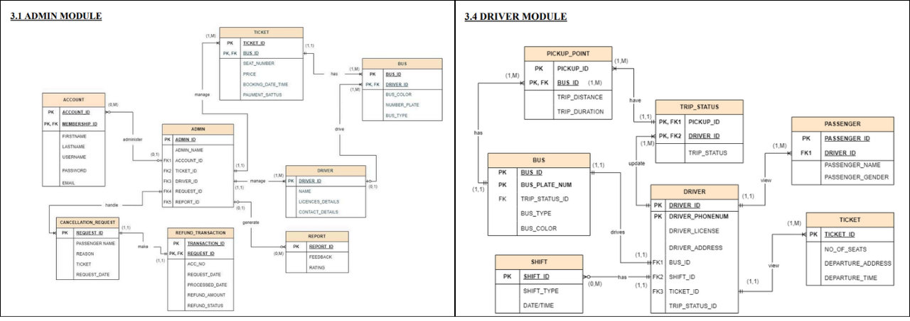
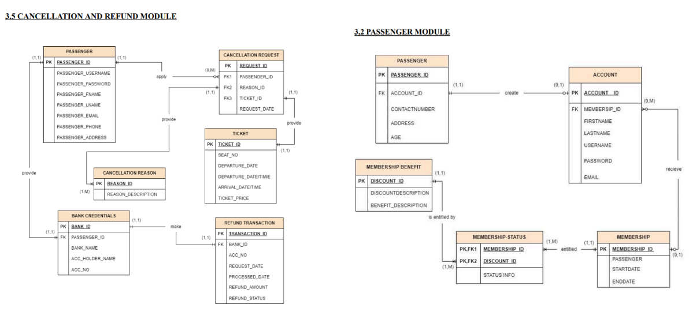
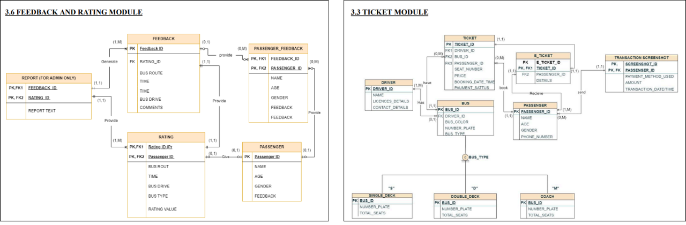
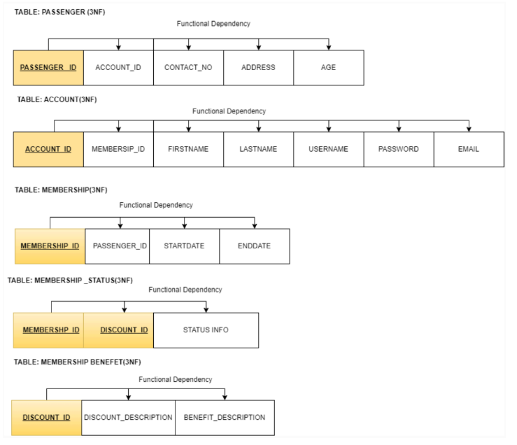
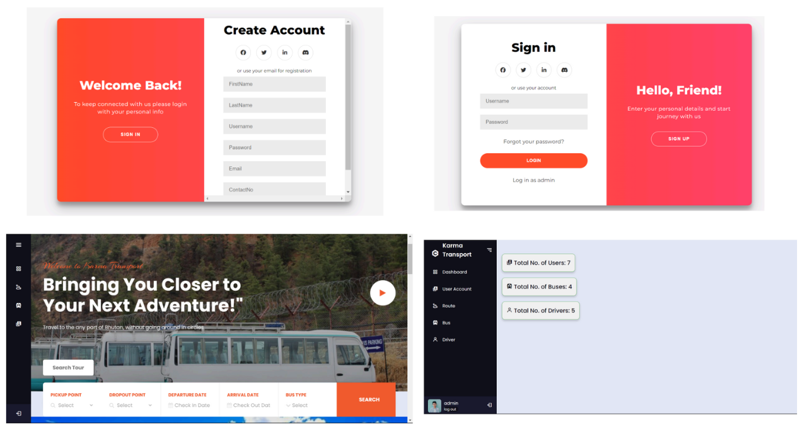
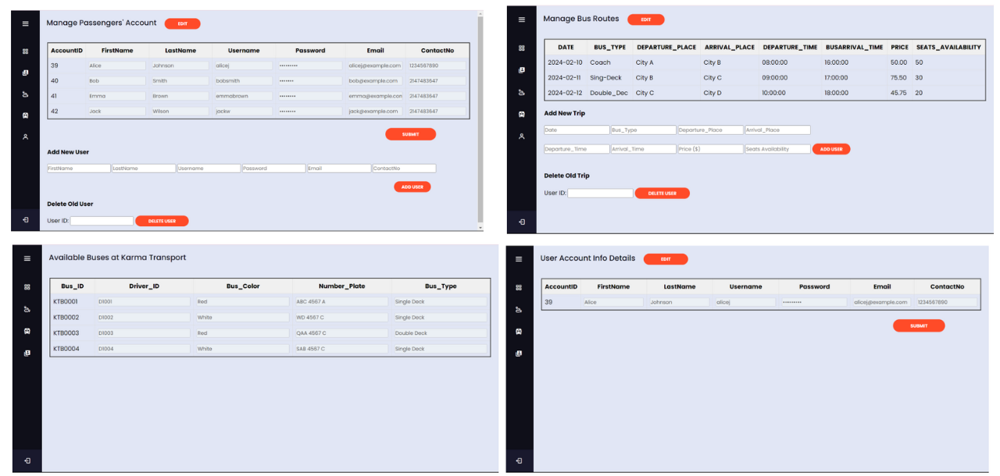
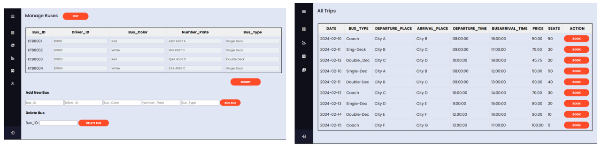

# Bus-Booking Management System for Karma Transport

## Project Overview

This project digitizes and automates the traditional bus-booking process, making it more accessible and efficient for both passengers and administrators.  
The system provides end-to-end ticket management, refund handling, feedback collection, and a centralized dashboard to monitor users, drivers, and routes.

---

## Features

- Online ticket booking and secure payment flow  
- Passenger registration / authentication  
- Ticket cancellation and refund module  
- Feedback submission and tracking  
- Admin dashboard for buses, routes, and drivers  
- Relational database design with full normalization (1NF → 3NF)  
- Comprehensive ERD for backend planning  

---

## Technologies Used

| Layer      | Stack                         |
|------------|------------------------------|
| Frontend   | HTML • CSS • JavaScript      |
| Backend    | PHP                          |
| Database   | MySQL                        |
| Dev Tools  | XAMPP / WAMP (local testing) |

---

## Entity Relationship Modelling (ERD)

---

## Database Normalization (1NF, 2NF, 3NF)

---

## Webpage Demo

---

## Project Documentation

[Download the Final Report (PDF)
Send me mail
---

## Contact

For questions or collaboration opportunities:  

- Email: md.farmanali200346@gmail.com
  Organization: Albukhary International University 

---
